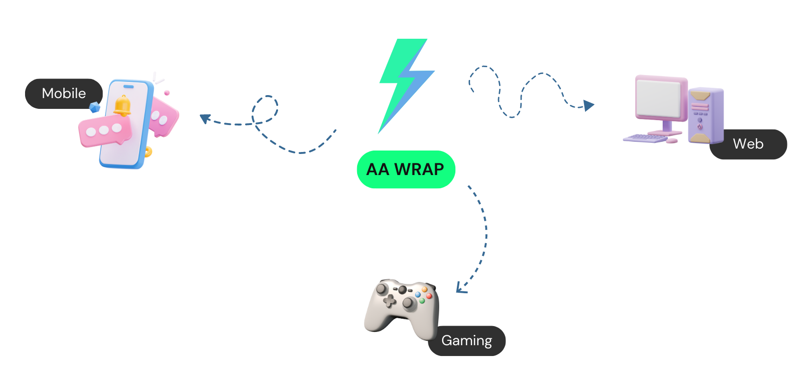

# **Safe Core Wrap** &middot; 

## The Safe Core Wrap

The Safe Core Wrap is a Polywrap-powered version of the [official Safe Core SDK](https://github.com/safe-global/safe-core-sdk). It allows developers to build ["smart accounts"](https://docs.safe.global/safe-core-protocol/safe-core-protocol), accounts with fully customizable functionality.

Smart accounts aim to bring much-needed UX improvements to web3.

Today, it includes functionality to:

- Create customizable, secure, and modular smart accounts (on top of Safe contracts).
- Enable a gas-less user experience via Gelato, offer sponsored transactions, and allow for fee payments in ERC-20 tokens.

## Playground

This project includes a [playground](./playground) with a few scripts that can be used as a starting point to use the Safe Core Wrap.

## Contributing

Please check out our [contributing guide](./CONTRIBUTING.md) for guidelines about how to proceed.
