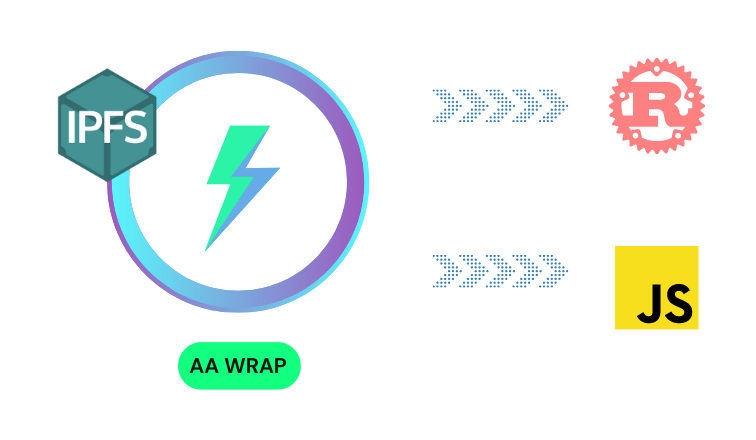

## Playground Overview

In this demo, you'll be executing scripts that showcase the AA Wrap's main value props: **multi-platform** and **composability**.



## Table of Contents

- [Playground set up](#playground-setup)
- [Available scripts](#available-scripts)

## Playground Setup

First, you'll set up the demo.

1. Create and configure a `.env` file with the following variables (you can use the `RPC_URL` provided below):

```bash
PRIVATE_KEY=
RPC_URL="https://goerli.infura.io/v3/41fbecf847994df5a9652b1210effd8a"
```

2. You will need to add a private key too; if you don't have any, you can create one from [Metamask](https://support.metamask.io/hc/en-us/articles/360015289632-How-to-export-an-account-s-private-key) and input them as values for `PRIVATE_KEY`

   > ⚠️ Make sure this account is one that you're only using for testing purposes!

3. Supply your account with Goerli ETH in order to send transactions. You can use a [Goerli faucet](https://goerlifaucet.com/) to do this.

4. Now you should be able to execute demos. Go to the any subfolder from the `playground` folder and check the respective README to know available commands

## Available scripts

| Script Name                | Description                                                                               |
| --------------------- | ----------------------------------------------------------------------------------------- |
| `deploy-safe`         | Deploys your Safe smart account                                                           |
| `sponsor-transaction` | Execute a sponsored transaction. This transaction is paid by 1Balance Relayer from Gelato |
| `paid-transaction`    | Execute a transaction that is paid from the ether or supported ERC20 in Safe              |
